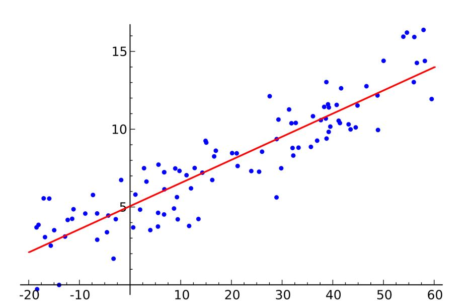
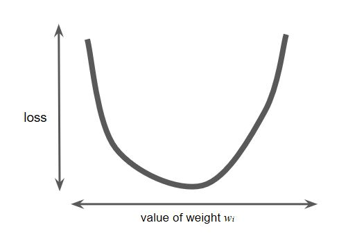
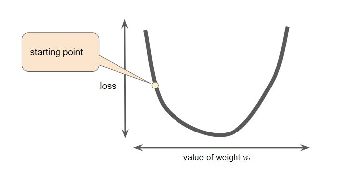
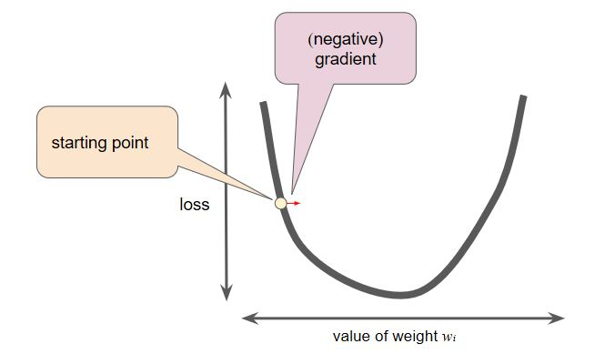

## How would you describe the difference between gradient descent and normal equations as two methods of fitting a linear regression?

First of all let's understand what is `Linear Regression`

#### Linear Regression:

Regression is a method of modelling a target value `Y` based on independent predictors `X`. Regression techniques mostly differ based on the number of independent variables and the type of relationship between the independent and dependent variables.

Simple linear regression is a type of regression analysis where the number of independent variables is one and there is a linear relationship between the independent(X) and dependent(Y) variable. The red line in above diagram refers as the best fit line and the equation of this line is known as `Hypothesis Function`.

          ` Y = w0 + w1*X `  ## Linear Equation

where `w0` and `w1` are weight which we need to optimize so that we can fit best line to reduce loss.

` Gradient Descent is techniques to find the value of w0 and w1 using iterative process so that overall loss can be minimized`

### Gradient Descent:

Gradient descent is a first-order iterative optimization algorithm for finding the minimum of a function (Loss function). To find a local minimum of a function using gradient descent, one takes steps proportional to the negative of the gradient (or approximate gradient) of the function at the current point. If instead one takes steps proportional to the positive of the gradient, one approaches a local maximum of that function; the procedure is then known as gradient ascent.

Loss function for Linear function is quadratic equation `1/2(y_predicted - y_real)**2` whose shape looks like a bowl or convex as shown below.

Convex function has only one minimum value. For that value of `w` cost will be minimum. Finding minimum value of cost by using every value of `w` is very time consuming process, a better approach is **Gradient Descent**

The gradient descent algorithm takes a step in the direction of the negative gradient in order to reduce loss as quickly as possible.

To determine the next point along the loss function curve, the gradient descent algorithm adds some fraction of the gradient's magnitude to the starting point as shown in the following figure:

After that it will calculate derivative of cost function at that point which defines in which direction we need to move to reduce the cost.

The gradient descent then repeats this process, edging ever closer to the minimum.

### Normal Equation:

Normal equation is another approach for finding the global minimum or the weights (W) for which cost is minimum.
* For some linear regression problems Normal equation provides better solution.
* Gradient descent is iterative process while Normal equation solve `W` analytically.

Basic Step of Normal Equation is as below.

* Take derivative of `Cost function` w.r.t to `W`
* Set the derivative equal to 0.
* Allow you to solve for the value of `W` which minimizes `Cost function`.

To implement Normal Equation
* Take examples
* Add an extra column (x0 feature)
* Construct a matrix (X - the design matrix) which contains all the training data features in an `[m x n+1]` matrix.
* Do something similar for `Y`
    * Construct a column vector y `[m x 1]` matrix
* Using the following equation (X transpose * X) inverse times X transpose Y.
    * `W = (X_transpose*X)inverse*X_transpose*Y`
* If you compute above equation you will get value of `W` which minimize cost function.
